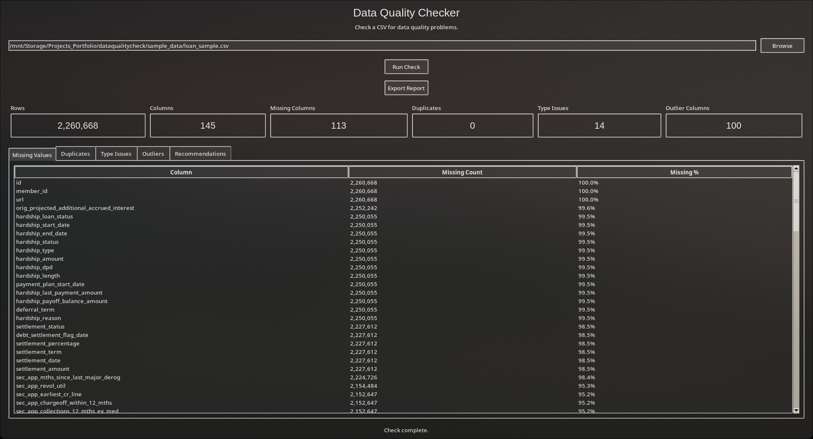

# CSV Data Quality Checker.

A small Python tool that scans CSV files for common data quality problems and produces a quick report.

It can be used from the command line or through the Tkinter dashboard.

## Why DOES this Exist?

~~(Because i needed a project for portfolio)~~ Every data analysis project starts with the same manual routine: checking
for missing values, duplicates, and type issues before trusting a dataset.
This tool automates that first-20-or-so-minutes routine into a single command or  dashboard made with Tkinter.

## How to use it?

1. venv or conda or if you like to be a but crazy just skip virtual enviornments altogether!

2. pip install -r requirements.txt

3. python dashboard.py

4. "Browse" and select the CSV

5. click "Run Check".

# OR If you want to use the commandline ver:

1. python dataqualitycheck.py path/to/your/file.csv

## Example OUTPUT

## What it does

- Row/column counts -- a basic sanity check on load.
- Missing values -- count and percentage per column.
- Duplicate rows -- full-row duplicate detection.
- Repeated values -- common repeated values in each column.
- Type issues -- text columns that are likely meant to be numeric.
- Outliers -- flagged using the standard IQR (1.5x interquartile range) method.
- Recommendations -- simple suggestions based on the issues found.
- Export -- The report exports as a .txt file.

## Dashboard

The dashboard provides separate tabs for:

- Missing Values
- Duplicates
- Type Issues
- Outliers
- Recommendations

It also gives a quick summary of the dataset at the top.

## Dataset I used:

https://www.kaggle.com/datasets/burak3ergun/loan-data-set?select=loan_data_set.csv (Packaged)

# I also used this dataset to test because it is larger:

https://www.kaggle.com/datasets/adarshsng/lending-club-loan-data-csv?resource=download (Not Packaged)

## Built With
Python, pandas, argparse, warnings, tkinter

## Author
Debojyoti Mondal (Caeluxiom)

made in Linux CachyOS Hyprland (ARCH LINUX DISTRO) so apologies in advance if it has issues on WINDOWS.